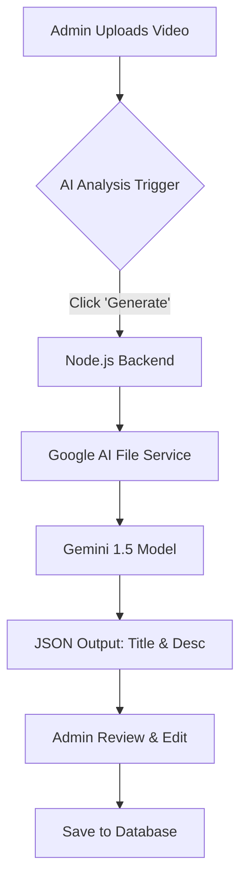

# Plan: AI-Powered Video Analysis for TheEducator LMS

This document outlines the strategy for implementing automated metadata generation (Title & Description) for lesson videos using Artificial Intelligence.

## 1. Objective
To streamline the content creation process for Admins by using AI to "watch" and "understand" uploaded videos, automatically suggesting professional titles and structured descriptions.

## 2. Recommended Technology
**Google Gemini 1.5 Flash/Pro**
- **Native Video Support**: Unlike other models, Gemini can process video files directly without manual frame extraction.
- **Multimodal capabilities**: It can understand visual cues, speech-to-text, and on-screen text simultaneously.

## 3. System Architecture

## 4. Implementation Steps

### Phase 1: AI Integration (Backend)
- Setup `@google/generative-ai` SDK.
- Create a `Secure` service to handle temporary video uploads to the AI Studio File Manager.
- Craft a **System Prompt** that enforces educational standards (e.g., "Generate a title that starts with the main topic and a description with bullet points for key learnings").

### Phase 2: User Interface (Frontend)
- Add a "Magic AI" button next to the Title field in the Course Module editor.
- Implement a status bar showing "AI is analyzing your video...".
- Add an "Apply" button to automatically fill the form fields with AI suggestions.

## 5. Security & Privacy
- **Retention**: Video files uploaded to the AI service will be deleted immediately after analysis.
- **Authentication**: Ensure only `role: admin` can trigger AI analysis to manage API costs.

## 6. Future Enhancements
- **Auto-Summarization**: Generate a shorter "Lesson Summary" for the course curriculum page.
- **Automated Keywords**: Generate SEO tags based on video content.
- **Transcript Generation**: Use the same AI pass to create a full text transcript for accessibility.

---
**Status**: Planning Phase
**Requirement**: Gemini API Key
